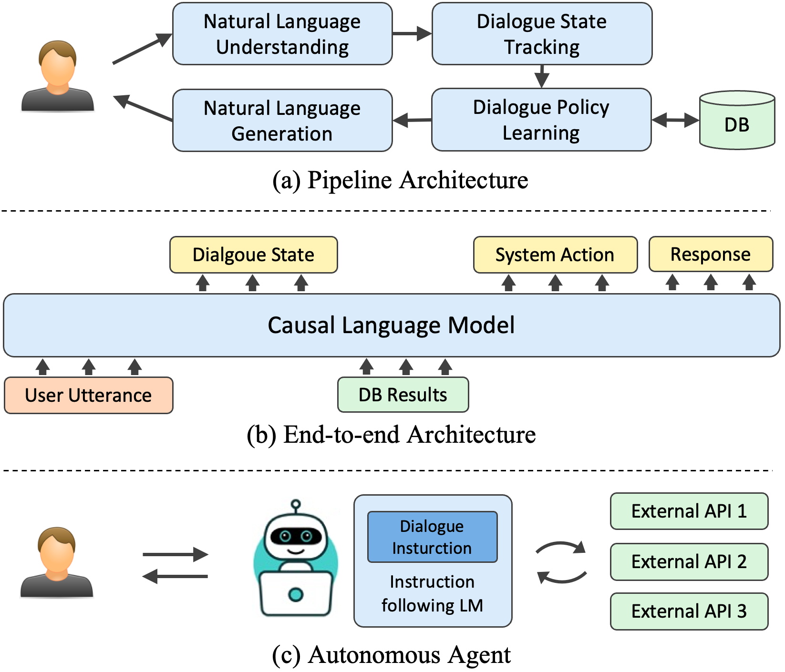

# AutoTOD

AutoTOD is a novel fully zero-shot autonomous agent for task-oriented dialogues. It deprecates all the delicate modules in traditional TOD systems and only uses an instruction-following language model to autonomously call external APIs and communicate with the user, which greatly reduces the construction cost and improves the generalization ability.

<!--  -->


# Requirements

- Python >= 3.6
- langchain == 0.0.166
- openai == 0.27.0
- tenacity == 8.2.2
- SQLAlchemy  == 2.0.13
- pydantic == 1.10.2
- click == 8.0.1
- termcolor == 2.3.0

# Preparation

## 1. Download preprocessed data

Download the preprocessed data from [Google Drive](https://drive.google.com/file/d/18ULn5nmzMMM9dMgGvtdybYcKniwdE3dL/view?usp=sharing) and extract it to the `data` directory.

## 2. Set OpenAI API Key

Provide the `OPENAI_API_KEY` in the environment variable.

```bash
export OPENAI_API_KEY=<your api key>
```

# Run AutoTOD for MultiWOZ

Run the notebook `run_mwoz.ipynb`.

# run AutoTOD for SGD

Run the notebook `run_sgd.ipynb`.

# Example Results

Example results are shown in `results` directory.

Results of MultiWOZ
- OpenAI text-davinci-003: `results/mwoz_davinci_003.json`
- OpenAI gpt-3.5-turbo-0301: `results/0301.json`
- OpenAI gpt-3.5-turbo-0613: `results/0613.json`

Results of SGD
- OpenAI gpt-3.5-turbo-0613: `results/sgd.json`
